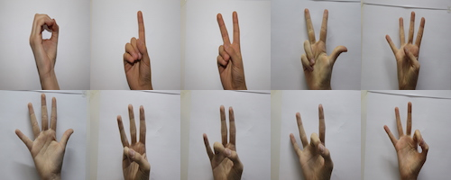
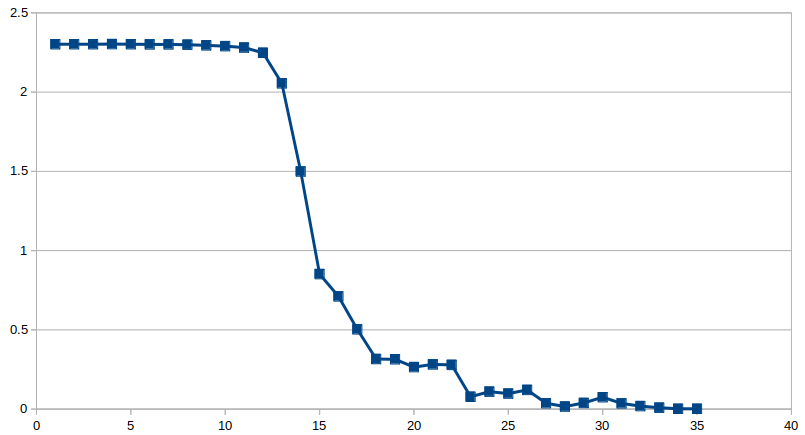

# Gesture Recognition
A simple implemention in pytorch for hand gesture recognition.
<p align="center">
  
</p>

Data source: [Baidu AI Studio]

[Baidu AI Studio]: https://aistudio.baidu.com/aistudio/education/group/info/1149?activityId&shared=1

## Environment
Ubuntu: 20.04

Python: 3.6.11

Torch: 1.5.0

Torchvision: 0.6.1

## Usage

1.Split data

```shell
python split_data.py
```

2. Train
```shell
python train_gesture.py
```

Train loss:
<p align="center">
  
</p>

3. Test
```shell
python test_gesture.py
```

